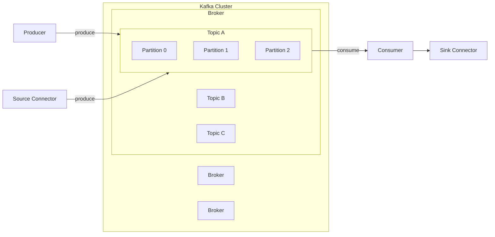

# Apache Kafka 기초 개념 정리

## 1. Kafka란 무엇인가

Apache Kafka는 **분산 이벤트 스트리밍 플랫폼**이다. 대량의 데이터를 **실시간으로 수집, 저장, 전달**하기 위해 설계되었으며, 로그 수집, 이벤트 기반 아키텍처, 스트림 처리의 핵심 인프라로 활용된다.

Kafka의 핵심 목적은 다음과 같다.

* 높은 처리량
* 낮은 지연 시간
* 장애 허용
* 데이터 영속성
* 재처리 가능성

---

## 2. Kafka가 해결하려는 문제

전통적인 동기식 통신(HTTP/RPC)은 다음과 같은 한계를 가진다.

* 서비스 간 강한 결합
* 장애 전파
* 트래픽 급증 시 병목 발생
* 비동기 처리 및 재처리 어려움

Kafka는 **이벤트 기반 비동기 통신**을 통해 위 문제를 해결한다.

---

## 3. Kafka 핵심 구성 요소

### 3.1 Broker

* Kafka 서버 인스턴스
* 여러 broker가 모여 **Kafka Cluster**를 구성
* 데이터를 Producer로부터 받아 offset 지정 후 디스크(토픽)에 저장하고, 
* Consumer의 Partition read에 응답해 디스크에 저장된 메시지를 전달하는 중개자(Broker) 역할 

#### Cluster 내에 한개씩 존재하는 역할 Broker

* **Controller**
    * 클러스터 내 브로커 상태를 관리하고 파티션 Leader 선출을 담당
    * 장애 발생 시 다른 브로커가 Controller 역할을 이어받음

* **Coordinator**
    * Consumer Group을 관리하고 파티션 할당 및 Rebalance 수행
    * Coordinator 장애 시 다른 브로커가 역할을 승계하며 Rebalance 발생
  
### 3.2 Topic

* 주제별로 관련된 이벤트를 분류하는 논리적 단위
* 하나의 topic은 N개의 **partition**으로 구성됨

### 3.3 Partition

* topic을 물리적으로 나눈 단위
* Kafka의 병렬성과 처리량의 핵심 요소
* partition 내부에서는 **메시지 순서 보장**
* 서로 다른 partition 간에는 순서 보장 없음

### 3.4 Offset

* partition 내에서 메시지의 고유한 위치
* 단조(값이 절대 줄어들지 않고, 항상 이전 값보다 커지거나 같음) 증가하는 값
* Kafka는 offset을 통해 메시지 소비 위치를 관리

---

## 4. Producer

* Kafka에 메시지를 발행(publish)하는 클라이언트
* 메시지는 특정 topic으로 전송됨

### 4.1 메시지 구조

* Key (선택)
* Value (실제 데이터)

### 4.2 Key의 역할

* 동일한 key를 가진 메시지는 **같은 partition**으로 전송됨
* 메시지 순서 보장이 필요한 경우 key 사용이 중요

---

## 5. Consumer

* 이벤트가 저장되어있는 topic에서 이벤트를 읽어오는 클라이언트

### 5.1 Consumer Group

* 하나의 group 내에서 partition은 **consumer 1개에만 할당**
* 이를 통해 병렬 처리와 확장성 확보

| Partition 수 | Consumer 수 | 동작                         |
| ----------- | ---------- |----------------------------|
| 3           | 1          | 1 consumer가 모두 처리          |
| 3           | 3          | 각 consumer가 1 partition 처리 |
| 3           | 5          | 2개의 consumer는 미할당 상태       |

### 5.2 Offset 관리

* Consumer는 읽어온 offset을 기록하여 자체적으로 읽은데이터의 위치를 추적
* * offset은 Kafka 내부 topic(`__consumer_offsets`)에 저장됨
* 이를 통해 Consumer는 중단된 지점에서 데이터를 다시 읽거나 특정 범위의 데이터만 읽어올 수 있다.

---

## 6. 메시지 전달 보장 수준

Kafka는 다음과 같은 전달 보장 전략을 제공한다.

### 6.1 At Most Once

* 메시지가 최대 한 번 전달
* 유실 가능성 존재

### 6.2 At Least Once (기본)

* 메시지가 최소 한 번 전달
* 중복 가능성 존재

### 6.3 Exactly Once

* 메시지가 정확히 한 번만 처리
* 트랜잭션, idempotent producer 설정 필요

---

## 7. Kafka의 영속성 구조

* 메시지는 디스크에 저장됨
* 로그 파일은 append-only 구조
* OS page cache를 활용하여 높은 성능 유지

### 7.1 Retention 정책

* 일정 시간(retention.ms)
* 일정 크기(retention.bytes)
* 조건 충족 시 오래된 메시지 삭제

---
## 8. Replication 기반 장애 대응 구조

### 8.1 Replication Factor (복제 전략)

Replication Factor는 하나의 partition이 **몇 개의 broker에 복제되어 저장되는지**를 의미한다.

* replication factor = 3

    * 동일한 partition 데이터가 서로 다른 3개의 broker에 저장됨
* 각 replica는 장애 격리를 위해 서로 다른 broker에 분산 배치됨

이 복제 전략을 통해 Kafka는 broker 장애 발생 시에도
데이터를 유지하고 서비스를 지속할 수 있는 기반을 마련한다.

### 8.2 Leader / Follower 구조 (역할 분리)

Kafka는 각 partition에 대해 **Leader / Follower 구조**를 사용한다.

* **Leader**

    * 해당 partition에 대한 모든 read / write 요청을 처리
    * producer와 consumer는 항상 leader와 통신

* **Follower**

    * leader의 데이터를 지속적으로 복제
    * 직접적인 read / write 요청은 처리하지 않음
    * leader 장애 시 새로운 leader 후보가 됨

이 구조를 통해 Kafka는
단일 쓰기 지점을 유지하면서도 장애에 대비할 수 있다.

### 8.3 ISR (In-Sync Replicas) 기반 Leader 선출

ISR(In-Sync Replicas)는
**leader와 충분히 동기화된 replica들의 집합**을 의미한다.

* leader는 항상 ISR에 포함됨
* follower는 leader의 최신 offset을 일정 시간 내에 따라잡아야 ISR에 포함됨

Kafka는 장애 발생 시
**ISR에 포함된 replica 중에서만 leader를 선출**한다.
이를 통해 데이터 유실 가능성을 최소화한다.

### 8.4 장애 발생 시 전체 동작 흐름

1. Leader broker 장애 발생
2. Kafka Controller가 장애 감지
3. ISR에 포함된 follower 중 하나를 새로운 leader로 선출
4. producer / consumer는 자동으로 새 leader와 통신

이 과정은 자동으로 수행되며,
대부분의 경우 서비스 중단 없이 처리된다.

### 8.5 정리

* Replication Factor는 장애 대응의 물리적 기반을 제공한다.
* Leader / Follower 구조는 역할을 분리하여 일관성을 유지한다.
* ISR은 안전한 leader 선출을 위한 기준으로 사용된다.

Kafka의 장애 대응은
**복제 + 역할 분리 + ISR 기반 선출**이 결합된 단일한 구조이다.

---

## 9. Kafka의 장점과 한계

### 9.1 장점

* 매우 높은 처리량
* 느슨한 결합의 이벤트 기반 아키텍처
* 재처리 가능
* 확장성과 내결함성 우수

### 9.2 한계

* 정확한 전역 순서 보장 불가
* 운영 및 모니터링 복잡도
* 단순 메시지 큐 대비 학습 비용 높음

---

## 10. Kafka의 주요 사용 사례

* 이벤트 기반 마이크로서비스
* 로그 수집 및 분석
* CDC (Change Data Capture)
* 실시간 스트림 처리
* 비동기 트랜잭션 연계 (Saga 패턴)

---

## 11. Kafka와 메시지 큐의 차이

| 구분      | Kafka  | 전통적 MQ   |
|---------| ------ | -------- |
| 메시지 저장  | 디스크 기반 | 메모리 중심   |
| 재처리     | 가능     | 제한적      |
| * 소비 모델 | Pull   | Push     |
| 처리량     | 매우 높음  | 상대적으로 낮음 |

**소비 모델**이란 메시지를 소비하는 주체와 전달 방식에 대한 구조이며, Kafka는 consumer가 직접 메시지를 가져오는 Pull 방식, 전통적 MQ는 broker가 메시지를 전달하는 Push 방식을 사용한다.

---

## 12. 정리

Kafka는 단순한 메시지 브로커가 아니라 **이벤트 스트리밍 플랫폼**이다. 분산 환경에서 데이터 흐름을 안정적으로 처리하고, 서비스 간 결합도를 낮추며, 장애와 재처리를 고려한 아키텍처를 구성하는 데 핵심적인 역할을 한다.

실무에서는 Kafka 자체보다도 **어떤 이벤트를 발행하고, 어디까지를 트랜잭션 경계로 볼 것인가**에 대한 설계가 더 중요하다.
