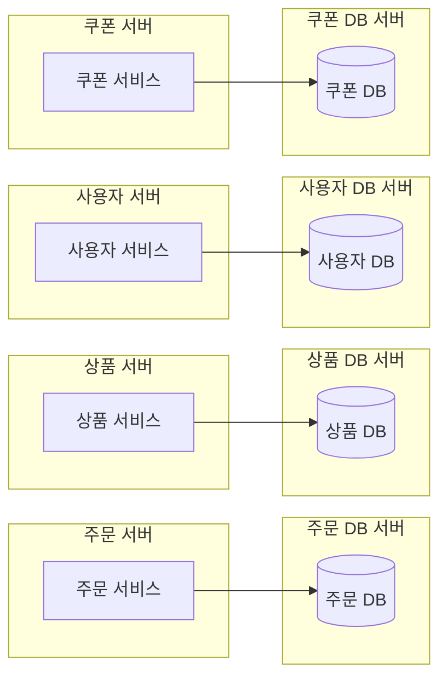
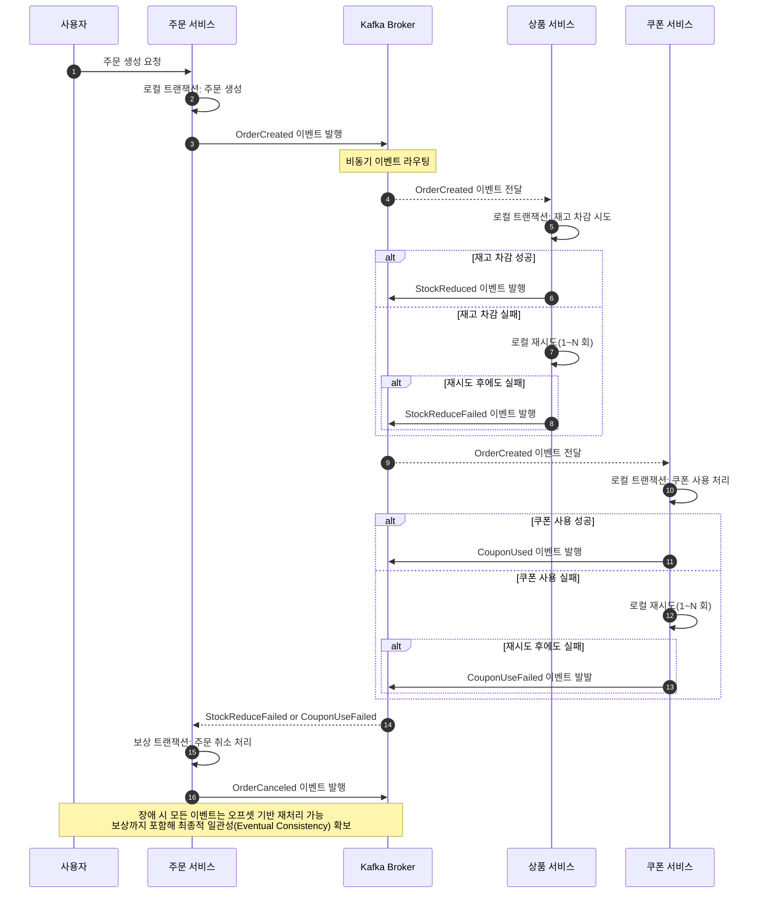

# 분산 트랜잭션 처리 설계 문서
 
## 1. 배경 및 목적

서비스 확장에 따라 애플리케이션 서버와 데이터베이스를 도메인 단위로 분리하는 것은 일반적인 아키텍처 진화 방식이다. 예를 들어 다음과 같이 독립된 서비스 및 데이터베이스가 구성될 수 있다.

- 주문 서비스 → 주문 DB

- 상품 서비스 → 상품 DB

- 사용자 서비스 → 사용자 DB

- 쿠폰 서비스 → 쿠폰 DB

도메인 별 분리는 다음과 같은 이점을 제공한다.

1. 독립적인 확장성 확보
2. 장애 격리를 통한 안정성 향상
3. 개발팀 단위의 독립 배포 및 운영 가능

그러나 물리적 분리가 발생하면 단일 DB 트랜잭션 기반의 일관성 보장이 불가능해지고, 분산 트랜잭션 문제가 필연적으로 발생하게 된다.

---

## 2. 분산 환경에서의 트랜잭션 문제

아래는 서비스와 데이터베이스가 분리된 구조를 나타낸다.

도메인 별 서버/DB가 분리되면 각 서비스는 “자신의 DB에 대한 로컬 트랜잭션만” 수행할 수 있다. 하나의 비즈니스 요청이 여러 서비스를 거쳐 처리될 때 다음 문제가 발생한다.

예시 시나리오: 주문 생성

1) 주문 서비스 → 주문 DB에 주문 생성
2) 상품 서비스 → 상품 DB에서 재고 차감
3) 쿠폰 서비스 → 쿠폰 DB에서 쿠폰 사용 처리

이 작업들은 서로 다른 DB, 서로 다른 로컬 트랜잭션으로 동작한다. 그 결과 다음과 같은 문제가 발생한다.

### 분산 트랜잭션의 주요 문제
1) 2PC(2-Phase Commit) 비현실성

    서비스 간 네트워크/락/장애 등의 변수를 고려하면 2PC는 운영 비용과 성능 저하가 크고, 사실상 실무에서 채택하기 어렵다.

2) 단일 트랜잭션 불가능   
    “주문 생성은 성공했지만 재고 차감 실패”와 같은 상태 불일치 발생 가능.

3) 보상 트랜잭션 필요   
    Saga 패턴과 같은 보상 로직을 구현해야 하며, 이는 개발 복잡성을 크게 증가시킨다.

4) 강한 일관성 유지 어려움   
    결국 Eventual Consistency 모델을 수용해야 하는 구조가 된다.

--- 

## 3. 해결책: 메시지 브로커 기반 비동기 이벤트 처리

분산 트랜잭션 문제를 해결하기 위해, 메시지 브로커 기반의 비동기 이벤트 처리 방식을 적용한다.
Kafka는 이 패턴을 지원하기 위한 핵심 기능을 제공한다.

### Kafka가 제공하는 핵심 기능
1) 높은 처리량 및 확장성    
    주문·쿠폰 발급 등 고빈도 이벤트 환경에서도 병목 없이 처리 가능하다.

2) 로그 기반 저장(Commit Log)으로 메시지 영속성 보장   
    브로커 또는 서비스 장애가 발생해도 메시지를 유실하지 않는다.

3) 파티셔닝을 통한 순서 보장 (Partition Ordering)   
    동일 키(ex: orderId, couponId)로 파티션을 고정하면 파티션 내 이벤트는 순서가 보장된다.
    주문 → 결제 → 배송 같은 순서 의존적 프로세스 처리에 유효하다.

4) 내결함성 및 클러스터링   
    리더–팔로워 구조를 통해 장애 복구가 자동으로 이루어진다.

5) 재처리(Replay) 지원   
    Consumer의 오프셋을 이동시키면 메시지를 재생할 수 있어 장애 상황 또는 로직 수정 후 재처리가 가능하다.

Kafka를 활용하면 위의 기능을 통해 네트워크 장애, 부분 실패, 순서 불일치 등 분산 환경에서 흔히 발생하는 문제들을 제어하며,
비동기적이고 확장 가능한 방식으로 트랜잭션 일관성을 보장할 수 있다.

---

## 4. Kafka를 통한 분산 트랜잭션 해결 전략

### 1. 정상 흐름

주문 서비스는 자신의 로컬 트랜잭션을 정상적으로 완료   
Kafka에 OrderCreated 이벤트 발행
상품·쿠폰 서비스는 이벤트를 소비하고 각자 로컬 트랜잭션 처리

### 2. 실패 흐름: 상품 서비스(재고 차감) 실패

상품 서비스의 재고 차감 로직이 실패하면   
자체 재시도 수행 (예: 네트워크 이슈, Lock 충돌 등)   
여러 번 재시도 후에도 실패 시 StockReduceFailed 이벤트 발행

실패 이벤트는 보상 트랜잭션의 트리거가 된다.

### 3. 실패 흐름: 쿠폰 서비스 실패

동일하게 로컬 트랜잭션 실패 → 재시도 → 최종 실패 시 CouponUseFailed 이벤트 발행

### 4. 보상(Compensation) 트랜잭션 흐름

StockReduceFailed 혹은 CouponUseFailed 중 하나라도 Kafka에 들어오면,   
주문 서비스는 보상 트랜잭션을 수행한다.   
주문 상태를 "취소"로 변경 후 취소 이벤트(OrderCanceled) 발행

이후 필요한 서비스들은 취소 이벤트 기반 후속 작업 수행(재고 복원 등)

### 5. Kafka 기반 재처리(Reprocessing)

Kafka는 모든 이벤트를 Commit Log에 저장하므로 다음과 같은 상황에도 재시도가 가능하며
**최종적 일관성(Eventual Consistency)**을 유지할 수 있게 된다.

- 서비스 장애
- Consumer 다운
- 네트워크 오류
- 일시적 DB 장애

