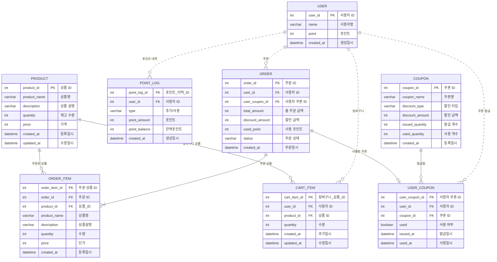

```mermaid
erDiagram
    USER ||..o{ ORDER : "주문"
    USER ||..o{ CART_ITEM : "장바구니"
    USER ||..o{ USER_COUPON : "쿠폰 발급"
    USER ||..o{ POINT_LOG : "포인트 내역"
    ORDER ||--|{ ORDER_ITEM : "주문 상품"
    PRODUCT ||--o{ ORDER_ITEM : "주문된 상품"
    PRODUCT ||--o{ CART_ITEM : "장바구니 상품"
    COUPON ||--o{ USER_COUPON : "발급됨"
    ORDER ||--o| USER_COUPON : "사용한 쿠폰"

    %% 사용자 테이블
    USER {
        int      user_id PK "사용자 ID"
        varchar  name       "사용자명"
        int      point      "포인트"
        datetime created_at "생성일시"
    }

    %% 포인트 로그 테이블
    POINT_LOG {
        int      point_log_id PK "포인트_이력_ID"
        int      user_id FK      "사용자 ID"
        varchar  type            "추가/사용"
        int      point_amount    "포인트"
        int      point_balance   "잔액포인트"
        datetime created_at      "생성일시"
    }

    %% 주문 테이블
    ORDER {
        int      order_id PK       "주문 ID"
        int      user_id FK        "사용자 ID"
        int      user_coupon_id FK "사용자 쿠폰 ID"
        int      total_amount      "총 주문 금액"
        int      discount_amount   "할인 금액"
        int      used_point        "사용 포인트"
        varchar  status            "주문 상태"
        datetime created_at        "주문일시"
    }

    %% 주문 아이템 테이블
    ORDER_ITEM {
        int      order_item_id PK     "주문 상품 ID"
        int      order_id FK          "주문 ID"
        int      product_id FK        "상품_ID"
        varchar  product_name         "상품명"
        varchar  description          "상품설명"
        int      quantity             "수량"
        int      price                "단가"
        datetime created_at           "등록일시"
    }

    %% 쿠폰 테이블
    COUPON {
        int      coupon_id PK    "쿠폰 ID"
        varchar  coupon_name     "쿠폰명"
        varchar  discount_type   "할인 타입"
        int      discount_amount "할인 금액"
        int      issued_quantity "발급 개수"
        int      used_quantity   "사용 개수"
        datetime created_at      "등록일시"
    }

    %% 사용자 쿠폰 테이블
    USER_COUPON {
        int      user_coupon_id PK "사용자 쿠폰 ID"
        int      user_id FK        "사용자 ID"
        int      coupon_id FK      "쿠폰 ID"
        boolean  used              "사용 여부"
        datetime issued_at         "발급일시"
        datetime used_at           "사용일시"
    }

    %% 장바구니 테이블
    CART_ITEM {
        int      cart_item_id PK  "장바구니_상품_ID"
        int      user_id FK       "사용자 ID"
        int      product_id FK    "상품 ID"
        int      quantity         "수량"
        datetime created_at       "추가일시"
        datetime updated_at       "수정일시"
    }

    %% 상품 테이블
    PRODUCT {
        int      product_id PK "상품 ID"
        varchar  product_name  "상품명"
        varchar  description   "상품 설명"
        int      quantity      "재고 수량"
        int      price         "가격"
        datetime created_at    "등록일시"
        datetime updated_at    "수정일시"
    }
```