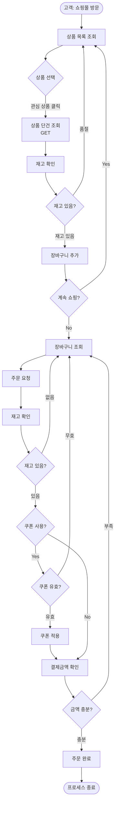

# 전체 구매 프로세스

### 프로세스 개요
고객이 상품을 조회하고, 장바구니에 담고, 쿠폰을 사용하여 주문을 완료하는 전체 구매 프로세스

### 전체 프로세스 플로우

```mermaid
flowchart TD
  Start([고객: 쇼핑몰 방문]) --> ViewList[상품 목록 조회]

  ViewList --> SelectProduct{상품 선택}
  SelectProduct -->|관심 상품 클릭| ViewDetail[상품 단건 조회<br/>GET]

  ViewDetail --> CheckStock[재고 확인]

  CheckStock --> StockAvailable{재고 있음?}
  StockAvailable -->|품절| ViewList
  StockAvailable -->|재고 있음| AddToCart[장바구니 추가]

  AddToCart --> ContinueShopping{계속 쇼핑?}
  ContinueShopping -->|Yes| ViewList
  ContinueShopping -->|No| ViewCart[장바구니 조회]

  ViewCart --> CreateOrder[주문 요청]

  CreateOrder --> ValidateStock[재고 확인]
  ValidateStock --> StockCheck{재고 있음?}
  StockCheck -->|없음| ViewCart
  StockCheck -->|있음| UseCoupon{쿠폰 사용?}

  UseCoupon -->|Yes| ValidateCoupon{쿠폰 유효?}
  ValidateCoupon -->|유효| ApplyCoupon[쿠폰 적용]
  ValidateCoupon -->|무효| ViewCart
  ApplyCoupon --> CheckPayment[결제금액 확인]

  UseCoupon -->|No| CheckPayment

  CheckPayment --> BalanceCheck{금액 충분?}
  BalanceCheck -->|부족| ViewCart
  BalanceCheck -->|충분| OrderComplete[주문 완료]
  OrderComplete --> End([프로세스 종료])

```