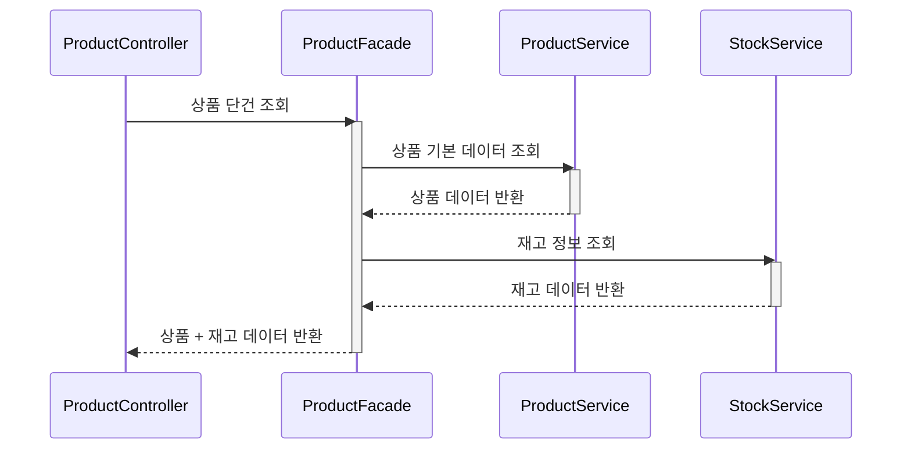
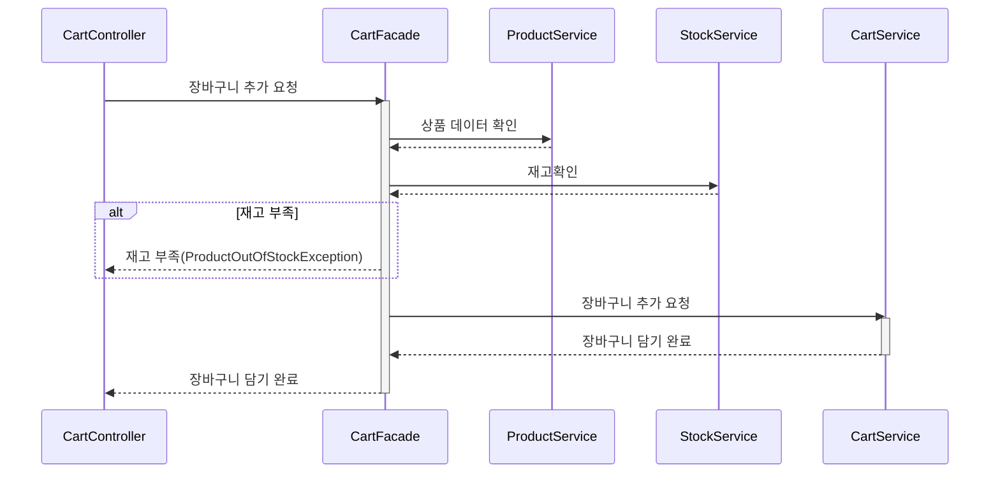
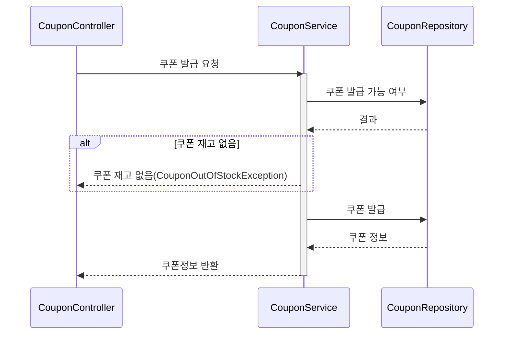
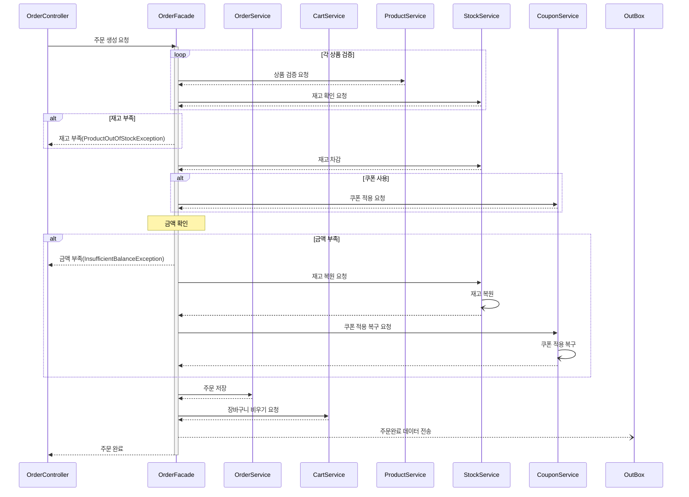

# 프로젝트 핵심 비즈니스 Sequence Diagram

---

## 1. 상품 상세 조회

```mermaid
sequenceDiagram
    participant Controller as ProductController
    participant Facade as ProductFacade
    participant ProductService as ProductService
    participant StockService as StockService

    Controller->>Facade: 상품 단건 조회
    activate Facade

    Facade->>ProductService: 상품 기본 데이터 조회
    activate ProductService
    ProductService-->>Facade: 상품 데이터 반환
    deactivate ProductService

    Facade->>StockService: 재고 정보 조회
    activate StockService
    StockService-->>Facade: 재고 데이터 반환
    deactivate StockService

    Facade-->>Controller: 상품 + 재고 데이터 반환
    deactivate Facade
```

---

## 2. 장바구니 담기

```mermaid
sequenceDiagram
    participant Controller as CartController
    participant Facade as CartFacade
    participant ProductService as ProductService
    participant StockService as StockService
    participant CartService as CartService

    Controller->>Facade: 장바구니 추가 요청
    activate Facade

    Facade->>ProductService: 상품 데이터 확인
    ProductService-->>Facade: 

    Facade->>StockService: 재고확인
    StockService-->>Facade: 

    alt 재고 부족
        Facade-->>Controller: 재고 부족(ProductOutOfStockException)
    end
    Facade->>CartService: 장바구니 추가 요청
    activate CartService
    CartService-->>Facade: 장바구니 담기 완료
    deactivate CartService

    Facade-->>Controller: 장바구니 담기 완료
    
    deactivate Facade
```
---
## 3. 쿠폰 발급

```mermaid
sequenceDiagram
    participant Controller as CouponController
    participant Service as CouponService
    participant Repository as CouponRepository

    Controller->>Service: 쿠폰 발급 요청
    activate Service

    Service->>Repository: 쿠폰 발급 가능 여부
    Repository-->>Service: 결과

    alt 쿠폰 재고 없음
        Service-->>Controller: 쿠폰 재고 없음(CouponOutOfStockException)
    end 
        Service->>Repository: 쿠폰 발급
        Repository-->>Service: 쿠폰 정보
        Service-->>Controller: 쿠폰정보 반환

    deactivate Service
```
## 4. 주문 생성

```mermaid
sequenceDiagram
    participant Controller as OrderController
    participant Facade as OrderFacade
    participant OrderService as OrderService
    participant CartService as CartService
    participant ProductService as ProductService
    participant StockService as StockService
    participant CouponService as CouponService
    participant OutBox

    Controller->>Facade: 주문 생성 요청
    activate Facade

    loop 각 상품 검증
        Facade->>ProductService: 상품 검증 요청
        ProductService-->>Facade: 
        Facade->>StockService: 재고 확인 요청
        StockService-->>Facade: 
    end

    alt 재고 부족
        Facade-->>Controller: 재고 부족(ProductOutOfStockException)
    end
    
    Facade->>StockService: 재고 차감
    StockService-->>Facade: 

    alt 쿠폰 사용
        Facade->>CouponService: 쿠폰 적용 요청
        CouponService-->>Facade: 
    end

    note over Facade: 금액 확인

    alt 금액 부족
        Facade-->>Controller: 금액 부족(InsufficientBalanceException)
        Facade->>StockService: 재고 복원 요청
        StockService-)StockService: 재고 복원
        StockService-->>Facade: 

        Facade->>CouponService: 쿠폰 적용 복구 요청
        CouponService-)CouponService: 쿠폰 적용 복구
        CouponService-->>Facade: 
    end
    
    Facade->>OrderService: 주문 저장
    OrderService-->>Facade: 

    Facade->>CartService: 장바구니 비우기 요청
    CartService-->>Facade: 

    Facade--)OutBox: 주문완료 데이터 전송

    Facade-->>Controller: 주문 완료
    deactivate Facade
```