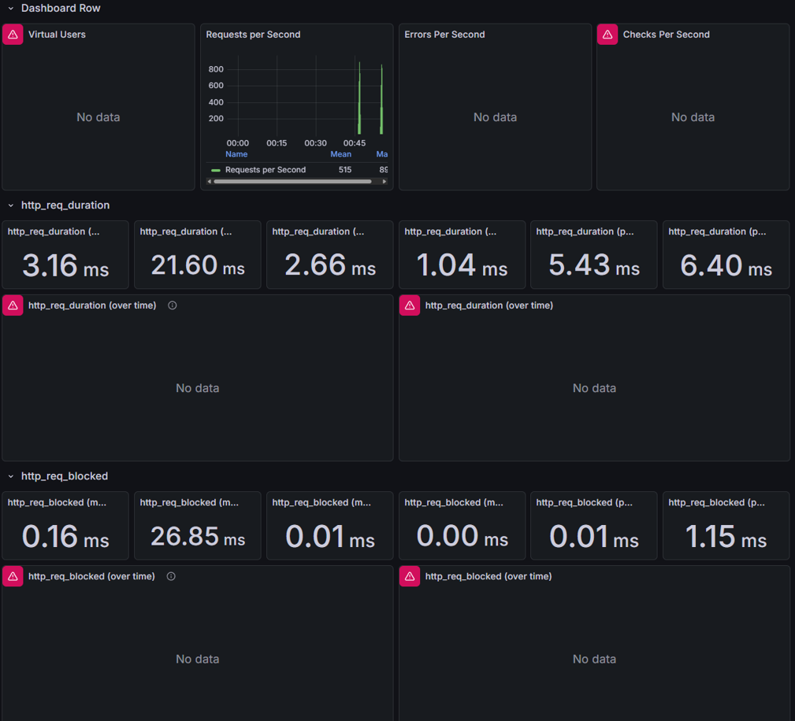
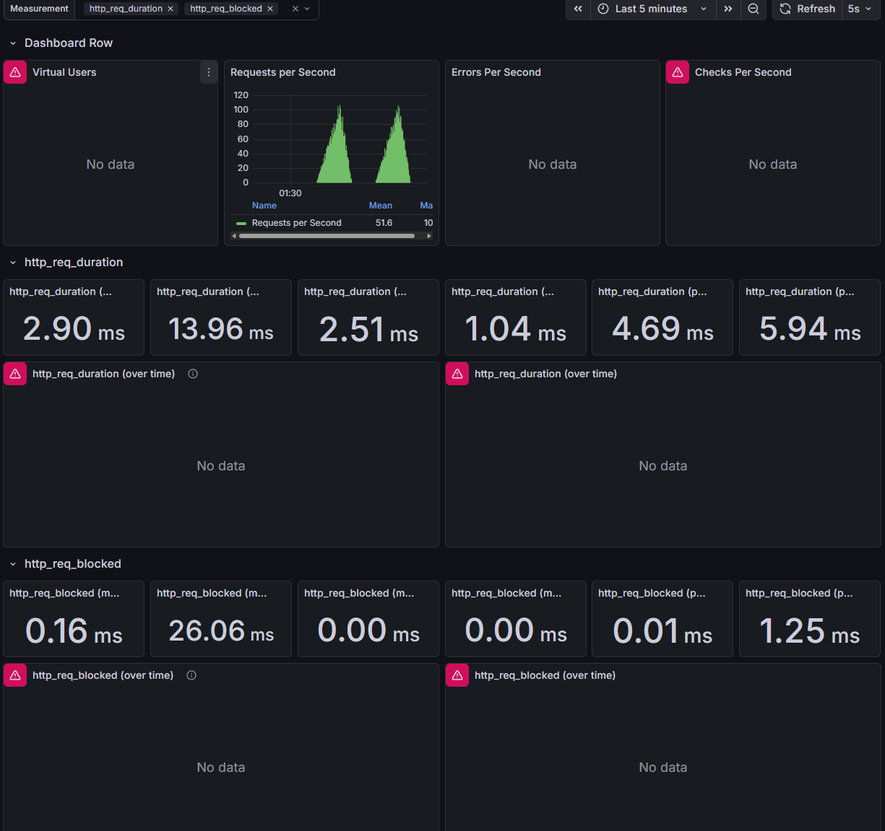

# 부하테스트 기반 성능 개선 보고서

## 1. 목적

본 보고서는 부하 테스트를 통해 시스템의 성능 특성을 분석하고,  
병목 지점을 식별하여 적절한 데이터베이스 인덱스를 적용함으로써  
응답 성능을 개선한 과정을 정리하는 것을 목적으로 한다.

---

## 2. 테스트 개요

### 2.1 테스트 환경

- 테스트 도구: k6
- 측정 지표:
    - Requests Per Second (RPS)
    - http_req_duration (응답 시간)
    - http_req_blocked (클라이언트 대기 시간)
- 테스트 방식:
    - 동일한 시나리오 및 부하 패턴으로 인덱스 적용 전/후 비교
    - 테스트 시간 및 가상 사용자 구성 동일

---

## 3. 인덱스 적용 전 성능 측정 결과

### 3.1 처리량 (Throughput)

- 평균 Requests Per Second: **약 51.5 rps**
- 처리량은 안정적이나, 일부 요청에서 응답 지연 발생

### 3.2 응답 시간 (http_req_duration)

| 지표 | 측정값 |
|---|---|
| 평균 (mean) | 3.16 ms |
| 중앙값 (p50) | 2.66 ms |
| p90 | 5.43 ms |
| p95 | 6.40 ms |
| 최대값 (max) | 21.60 ms |

- 평균 응답 시간은 양호하나
- 특정 요청에서 **상대적으로 큰 지연(max, p95)** 이 관측됨
- 이는 인덱스 미적용으로 인한 테이블 스캔 가능성으로 판단

### 3.3 부하테스트 결과 스크린샷 (인덱스 적용 전)



---

## 4. 개선 조치: 인덱스 적용

### 4.1 문제 식별

부하 테스트 중 응답 지연이 발생한 주요 조회 쿼리를 분석한 결과,
**조회수 기반 인기상품 조회 쿼리**에서 성능 병목이 확인되었다.

```sql
SELECT * FROM product ORDER BY view_count DESC LIMIT 10;
```

- 이 쿼리는 전체 product 테이블을 스캔하여 view_count로 정렬
- 인덱스가 없을 경우 테이블 전체를 읽고 정렬하는 비용 발생
- 데이터가 증가할수록 응답 시간 증가 예상

### 4.2 개선 전략

단순히 view_count에만 인덱스를 추가할 경우,
인덱스를 통해 정렬 순서를 찾더라도 실제 데이터를 조회하기 위해
추가적인 테이블 액세스(랜덤 I/O)가 발생한다.

이를 개선하기 위해 **커버링 인덱스(Covering Index)** 전략을 적용하였다.

### 4.3 적용한 인덱스

```sql
CREATE INDEX idx_product_popular_covering ON product(
    view_count DESC,
    product_id,
    product_name,
    price,
    quantity,
    description,
    created_at,
    update_at
);
```

---

## 5. 인덱스 적용 후 성능 측정 결과

### 5.1 처리량 (Throughput)

- 평균 Requests Per Second: **약 51.6 rps**
- 처리량은 인덱스 적용 전과 유사

### 5.2 응답 시간 (http_req_duration)

| 지표 | 적용 전 | 적용 후 | 변화 |
|---|---|---|---|
| 평균 (mean) | 3.16 ms | 2.90 ms | 개선 |
| 중앙값 (p50) | 2.66 ms | 2.51 ms | 개선 |
| p90 | 5.43 ms | 4.69 ms | 개선 |
| p95 | 6.40 ms | 5.94 ms | 개선 |
| 최대값 (max) | 21.60 ms | 13.96 ms | **큰 폭 개선** |

- 평균 응답 시간은 소폭 개선
- **상위 지연(p90, p95, max)이 눈에 띄게 감소**
- 응답 시간 분포가 전반적으로 안정화됨

### 5.3 부하테스트 결과 스크린샷 (인덱스 적용 후)



---

## 6. 결과 분석

### 6.1 성능 개선 원인

커버링 인덱스 적용으로 인한 주요 개선 요인은 다음과 같다:

1. **테이블 스캔 제거**
   - 기존: 전체 테이블 읽기 → 메모리에서 정렬
   - 개선: 인덱스 순차 스캔만으로 정렬된 결과 반환

2. **랜덤 I/O 제거**
   - 기존: 인덱스 → 테이블 액세스 (Random Access)
   - 개선: 인덱스만으로 모든 컬럼 조회 (Sequential Access)

3. **정렬 연산 제거**
   - 기존: ORDER BY 절을 위한 추가 정렬 작업
   - 개선: view_count DESC로 이미 정렬된 인덱스 활용

### 6.2 성능 특성 분석

- 평균 응답 시간은 소폭 개선 (3.16ms → 2.90ms)
- **최악 응답 시간(Tail Latency)에서 효과가 두드러짐**
  - p95: 6.40ms → 5.94ms (7.2% 개선)
  - max: 21.60ms → 13.96ms (35.4% 개선)

이는 데이터 증가 또는 트래픽 증가 시 발생할 수 있는
**성능 스파이크 리스크를 사전에 완화**한 것으로 판단된다.

---

## 7. 결론

부하 테스트를 통해 시스템의 성능 특성을 분석한 결과,
조회수 기반 인기상품 조회 쿼리에서 테이블 스캔 및 정렬 연산으로 인한
응답 지연이 발생하고 있음을 확인하였다.

이에 따라 **커버링 인덱스(Covering Index)** 를 적용하여
인덱스만으로 쿼리를 처리할 수 있도록 개선하였다.

그 결과 응답 시간의 상위 지연 구간(p90, p95, max)이 감소하여
전반적인 응답 안정성이 개선되었으며,
특히 최대 응답 시간이 **21.60ms에서 13.96ms로 약 35% 감소**하였다.

본 개선은 현재 트래픽뿐만 아니라
향후 상품 데이터 증가 및 동시 요청 증가 상황에서도
안정적인 인기상품 조회 성능을 유지하는 데 기여할 것으로 판단된다.
